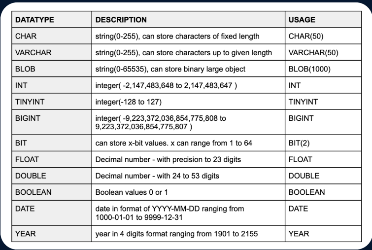
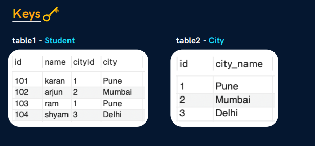

## Mysql Complete Notes

### Database 
  database is the collection of data in format that can be easily accessed . A software used to manage our DB is called DBMS 
  
### Types of databases
* Relational database :- data store in tables . ex: mysql 
* Non - relational :- data stores in files . ex: mongodb 

### What is sql ?

it is a structured query language , it helps to communicate with *Relational databases* .

We can perform CRUD (create read update delete) operations . 

 it is also called **SEQUES** (structured english query language) made by IBM 

### Database structure

Database is consists of many tables and each table is having data , that data can be inter related ... 
ex: school database will have students table, students fees table

**Creating our first database**
 our queries are like a simple english .
CREATE DATABASE db_name;

Note :- we can write query in both upper and lower case but we prefer *upper case* .

to delete database - DROP DATABASE db_name;

**Creating our first database**

USE db_name ; *Ye iss liye likhte hai taaki pta lage ki kis DB k liye table bnaane jaa rhe hai*

CREATE TABLE table_name(
    column_name1 datatype constraints(basically limits the data that will store)
    column_name2 datatype constraints
)

ex: CREATE  TABLE students (
    id INT PRIMARY KEY,
    name VARCHAR(50),
    age INT NOT NULL
)

**Inserting data in table**

INSERT INTO student VALUES (1,"ayush",22)

now as we made id a primary key , so it should be unique  and not null. 

**Sow all  data of a  table**

SELECT * from table_name;  

note :- * means select all data 

## Datatypes in Mysql

Their are so many datatypes in mysql .

**Char vs VarChar** 

char stores fixed length whereas varchar stores variable length . 

ex: when we assign 50 in char then 50 bit space will be assign to that from memory no matter wheather we are storing 50 bit or not . 

but in varchar if we assign 155 and put 50 bit data than only 50 bit will be utilize

**Blob** 
it can store large strings . basically , use to store binary objects 

**Bit**
it can store only the number of bit passed . ex: BIT (1). now , it will only be able to store 1 bit only. 

**Singed and unsigned**
as we know the numbers can be -ve and +ve ,  But some datatypes supports -ve to +ve ranges like tiny int , 

TINYINT range is (-128 to 127)

but to extend its range . and we know that our data will be unsigned . so we can use unsigned and extend the range 

so when we use TINYINT UNSIGNED  then the range will be (0 to 255)

## Types of Sql Commands 

All command of mysql can be categorize in the following types ...

1) **DDL(Data definition lang.)** :- create ,alter, rename , truncate & drop are comes under this .
2) **DQL(Data Query lang.)** :- Select
3) **DML(Data Manipulation lang.)** :- insert , update & delete 
4) **DCL(Data Control lang.)** :- grant & revoke permission to users .  Basically gives the access to the table 
5) **TCL(Transaction Control lang.)** :- start transaction , commit , rollback 

## Database related queries 

CREATE DATABASE IF NOT EXISTS db_name --> this will only create the DB when and only when the database doesn't exists. 

similarly , we can use if  exists with drop query
ex: DROP DATABASE IF  EXISTS db_name ;

To list all the databases --> SHOW DATABASES;

## Table related queries 

Create command is use to define the schema ( structure or design ) of table . 

ex: CREATE TABLE table_name (
    column_name datatype constraint ;
    ...
)

to print all data from table --> select * from table_name ;

to insert data in a table : INSERT INTO table_name VALUES (1,"ayush",23); 

## Concept of keys 

When we creates a table, it have some special columns . that are keys 

**Primary key**:- primary key is always a unique and not null , It uniquely identify the row . like roll no . Student's name can be same but roll number can't . 

**Foreign key** :- It is a column or set of columns that refers to the primary key of a table . 
as shown in this image ...

## Constraints 

constraints are some specific rules . 
suppose , we are storing age . but i want to store the only ages that are greater than 18.

their are so many constraints . some are : - 
NOT NULL , UNIQUE ,PRIMARY KEY etc

ex : CREATE TABLE data (id INT PRIMARY KEY,
name VARCHAR(100) NOT NULL,
email VARCHAR(155) UNIQUE NOT NULL )

Note:- *We can use primary key like this also and can pass other columns to make it combinational primary key... PRIMARY KEY(id,email) it may happen that email can repeat but the combination of it must be unique*

**Foreign key** :- It is basically use to link up two tables . 

prevent actions that would destroy links between tables 

CREATE TABLE temp(
    cust_id INT ,
    FOREIGN KEY(cust_id) REFERENCES customer(id)
)   
it references id present in the customer table 

**Default** :- it sets a default value for a column 
ex: salary INT DEFAULT 25000;

**check** :- it limits the value 

CREATE TABLE temp(
    cust_id INT ,
    FOREIGN KEY(cust_id) REFERENCES customer(id),
    CONSTRAINT age_check  CHECK (age>=18 AND city= "delhi")
)   

**select** :- command to select any data from db 
ex : SELECT col1, col2 from students 

we can also use DISTINCT keyword to not get repeatition 

ex: SELECT DISTICT col1,col2 FROM  students 

**Where clause** :- suppose we want to see the only data from students table where marks are greater than 80 

SELECT DISTINCT name FROM students WHERE marks> 80  
Note : *also we can club two conditions using logical operators like and or etc...*
ex:  SELECT DISTINCT name FROM students WHERE marks> 80  AND city = 'rajasthan';

**limit clause** :- it is use to limit the data . 

 SELECT * FROM students LIMIT 4;

 **order by clause** :- to change the order of the data . ASCE fro ascending and DESC for descending 

 SELECT * FROM students ORDER BY name ASC

 ## Agregate functions 

 they are the functions that have some bultin logic .
 we have functions like MAX , MIN , COUNT ,SUM , AVG,

 to use this . we will just write the function before the column to which we want to perform the action 

 ex : SELECT COUNT(*) FROM students ;

**Group by clause** 
It is use to group the rows that have the same values into summary rows. 

ex : SELECT city FROM students GROUP BY city

in this query , We have grouped the cities. but if we want to know how many students are studying in each cities .

 SELECT city , COUNT (rollno) FROM student GROUP BY city ;